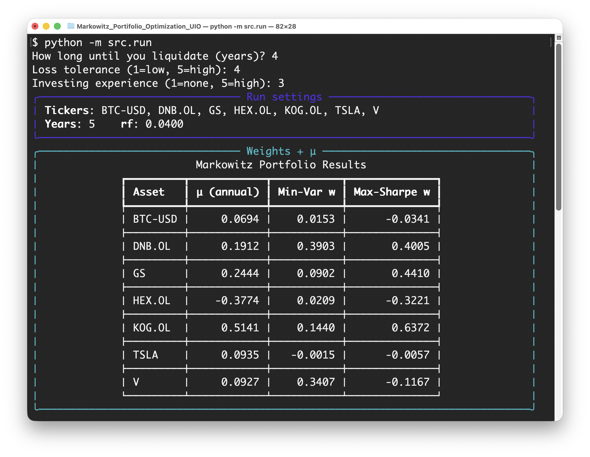
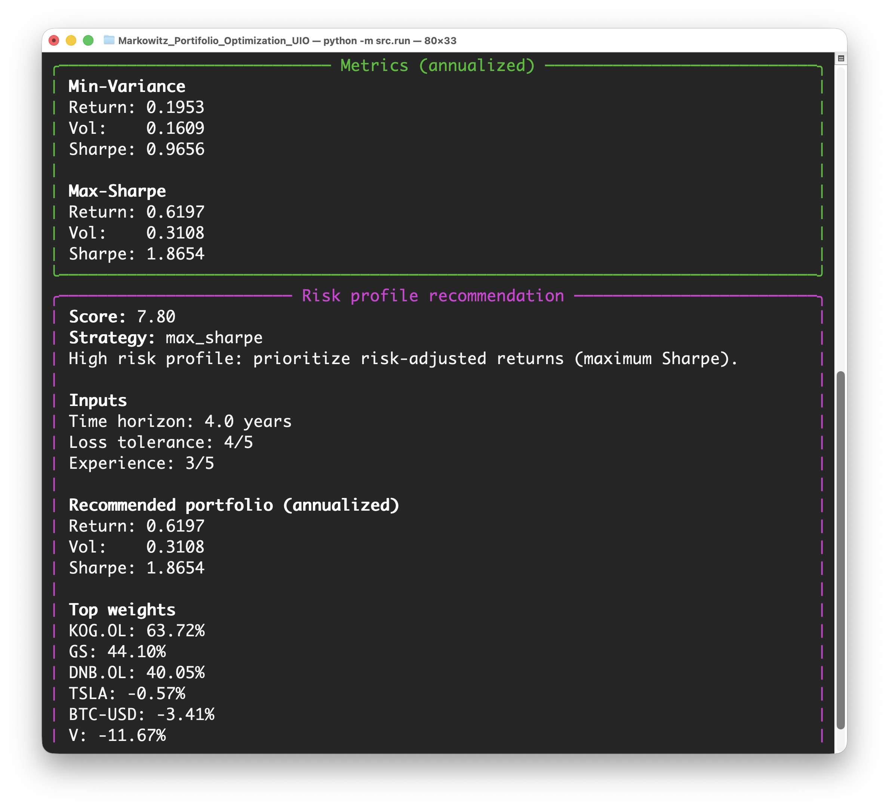
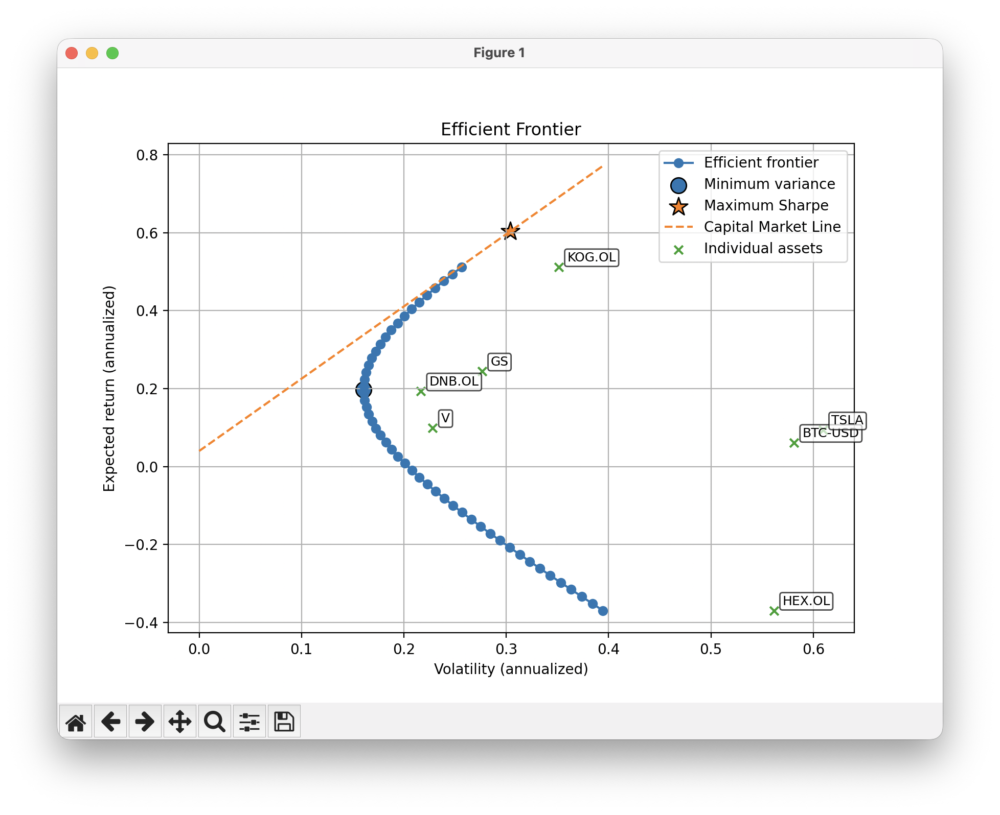

# Markowitz_Portifolio_Optimization_UIO
This is a repo used for portfolio optimization. Using a rule based model to make a risk profile. Based on that the user gets a suggested strategy. 

Input: 
- Tickers from yfinance
- How many years of data to be used
- risk free rent

## Author
- Albert Sjåvåg 
- BSc in Quantitative Finance | University of Oslo
- Email: albert.sjaavaag@gmail.com

Github repo link: https://github.com/albertsjavag/Markowitz_Portifolio_Optimization_UIO

# Demo: 

# The mathematics

## Expected return

Let $r_{i,t}$ denote the return of asset $i$ at time $t$.
The expected return is defined as

$$
    E[r_i]
$$

Since $E[r_i]$ is unknown, we estimate it from historical data using the sample mean

$$
    \bar{r}_i
    =
    \frac{1}{T}\sum_{t=1}^{T} r_{i,t}
$$

For daily data, the annualized expected return is

$$
    \mu_i
    =
    252\,\bar{r}_i
    =
    252\cdot\frac{1}{T}\sum_{t=1}^{T} r_{i,t}
$$

## Covariance matrix

Let $r_{i,t}$ and $r_{j,t}$ denote the returns of assets $i$ and $j$ at time $t$.
The covariance between assets $i$ and $j$ is defined as

$$
    \Sigma_{ij}
    =
    E\\left[(r_i - E[r_i])(r_j - E[r_j])\right]
$$

Since the true covariance is unknown, it is estimated from historical data as

$$
    \hat{\Sigma}_{ij}
    =
    \frac{1}{T-1}
    \sum_{t=1}^{T}
    (r_{i,t} - \bar{r}_i)(r_{j,t} - \bar{r}_j)
$$

Collecting all covariances yields the covariance matrix

$$
    \boldsymbol{\Sigma}
    =
    \begin{pmatrix}
    \Sigma_{11} & \Sigma_{12} & \cdots & \Sigma_{1N} \\
    \Sigma_{21} & \Sigma_{22} & \cdots & \Sigma_{2N} \\
    \vdots      & \vdots      & \ddots & \vdots      \\
    \Sigma_{N1} & \Sigma_{N2} & \cdots & \Sigma_{NN}
    \end{pmatrix}
$$

## Portfolio expected return

Let $\mathbf{w} = (w_1, \dots, w_N)^\top$ denote the portfolio weights.
The expected portfolio return is given by

$$
    E[r_p]
    =
    \mathbf{w}^\top \boldsymbol{\mu}
    =
    \sum_{i=1}^{N} w_i \mu_i
$$

## Portfolio variance and volatility

The variance of the portfolio return is given by

$$
    \mathrm{Var}(r_p)
    =
    \mathbf{w}^\top \boldsymbol{\Sigma}\\mathbf{w}
$$

The portfolio volatility (standard deviation) is therefore

$$
    \sigma_p
    =
    \sqrt{\mathbf{w}^\top \boldsymbol{\Sigma}\\mathbf{w}}
$$

## Sharpe ratio

Let $r_f$ denote the risk-free rate.
The Sharpe ratio of the portfolio is defined as

$$
    \mathrm{SR}
    =
    \frac{E[r_p] - r_f}{\sigma_p}
    =
    \frac{\mathbf{w}^\top \boldsymbol{\mu} - r_f}
    {\sqrt{\mathbf{w}^\top \boldsymbol{\Sigma}\\mathbf{w}}}
$$

## Markowitz mean–variance optimization

Given expected returns $\boldsymbol{\mu}$ and covariance matrix $\boldsymbol{\Sigma}$,
the mean–variance optimization problem can be written as

$$
    \min_{\mathbf{w}}
    \ \mathbf{w}^\top \boldsymbol{\Sigma}\\mathbf{w}
    \quad \text{subject to} \quad
    \mathbf{w}^\top \boldsymbol{\mu} = \mu_{\text{target}},
    \ \sum_{i=1}^{N} w_i = 1
$$

A common alternative formulation is the risk-aversion (quadratic utility) form

$$
    \max_{\mathbf{w}}
    \left(
    \mathbf{w}^\top \boldsymbol{\mu}
    -
    \frac{\lambda}{2}\mathbf{w}^\top \boldsymbol{\Sigma}\,\mathbf{w}
    \right)
    \quad \text{subject to} \quad
    \sum_{i=1}^{N} w_i = 1
$$

## Risk profiling model

We use a simple **heuristic risk profiling model** to map user preferences to a portfolio choice
along the efficient frontier.

Let the user provide the following inputs:

- Investment horizon (years): $T$
- Loss tolerance (integer scale): $L \in \{1,2,3,4,5\}$
- Investment experience (integer scale): $E \in \{1,2,3,4,5\}$

---

### Normalization

The investment horizon is capped and normalized to the interval $[0,1]$:

$$
    \tilde{T}
    =
    \frac{\min(T, 10)}{10}
$$

This prevents excessively long horizons from dominating the score.

---

### Risk score

The overall risk score is defined as a weighted sum:

$$
    S
    =
    4 \cdot \tilde{T}
    +
    1.1 \cdot L
    +
    0.6 \cdot E
$$

The coefficients are design parameters reflecting the relative importance of
time horizon, loss tolerance, and experience.

The resulting score typically lies in the interval:

$$
    S \in [0, 10]
$$

---

### Strategy selection

The risk score is mapped to a portfolio strategy using fixed thresholds:

$$
    \text{Strategy}(S)
    =
    \begin{cases}
    \text{Minimum Variance}, & S < 5.0 \\
    \text{Balanced}, & 5.0 \le S < 7.5 \\
    \text{Maximum Sharpe}, & S \ge 7.5
    \end{cases}
$$

### Balanced portfolio

For intermediate risk scores, a **balanced portfolio** is constructed as a convex
combination of the minimum-variance portfolio $w_{\min}$ and the maximum-Sharpe
portfolio $w_{\tan}$.

Define the interpolation parameter:

$$
    \alpha
    =
    \frac{S - 5.0}{7.5 - 5.0}
    \quad \text{with} \quad \alpha \in [0,1]
$$

The resulting portfolio weights are:

$$
    w
    =
    (1 - \alpha)\ w_{\min}
    +
    \alpha\ w_{\tan}
$$

Finally, the weights are normalized such that:

$$
    \sum_{i=1}^N w_i = 1
$$

---

This risk profiling model is heuristic and rule-based.
It does not rely on CAPM or utility maximization, but provides an intuitive
and transparent method for selecting a portfolio along the efficient frontier.

#### list of some tickers from yfinance:

	•	DNB: DNB.OL
	•	Telenor: TEL.OL
	•	Norsk Hydro: NHY.OL
	•	Yara International: YAR.OL
	•	Aker BP: AKRBP.OL
	•	Subsea 7: SUBC.OL
	•	Vår Energi: VAR.OL
	•	Kongsberg Gruppen: KOG.OL
	•	Mowi: MOWI.OL
	•	SalMar: SALM.OL
	•	Orkla: ORK.OL
	•	Gjensidige: GJF.OL
	•	Storebrand: STB.OL
	•	Apple: AAPL
	•	Microsoft: MSFT
	•	Alphabet: GOOGL
	•	Amazon: AMZN
	•	NVIDIA: NVDA
	•	Meta Platforms: META
	•	JPMorgan Chase: JPM
	•	Bank of America: BAC
	•	Goldman Sachs: GS
	•	Tesla: TSLA
	•	Coca-Cola: KO
	•	Procter & Gamble: PG
	•	Walmart: WMT
	•	Johnson & Johnson: JNJ
	•	Exxon Mobil: XOM
	•	Chevron: CVX

#### Note to self: 
bash: conda activate markowitz

